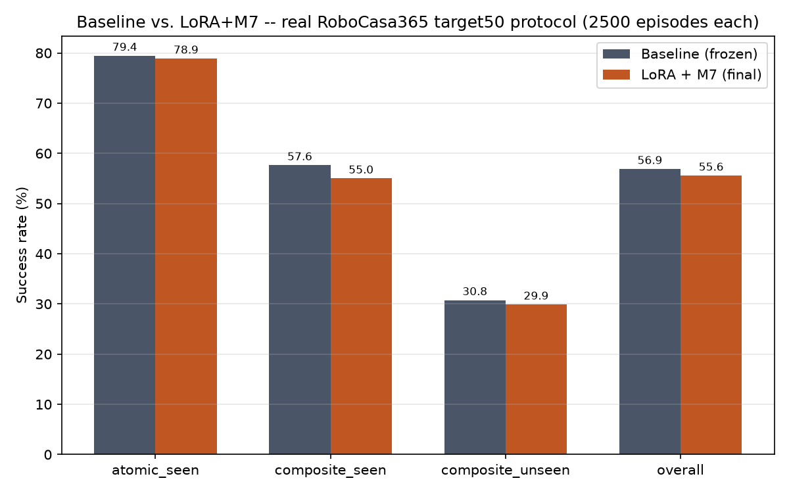
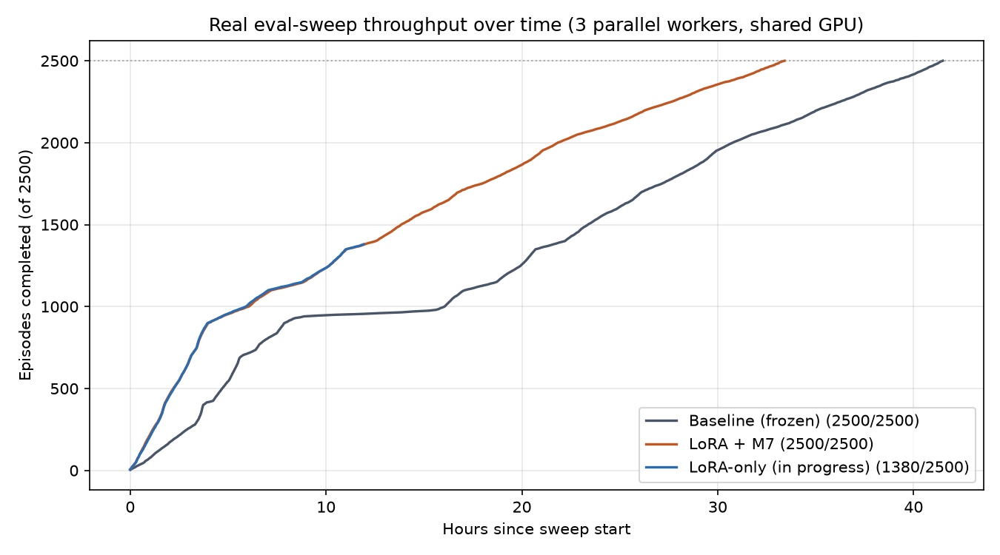
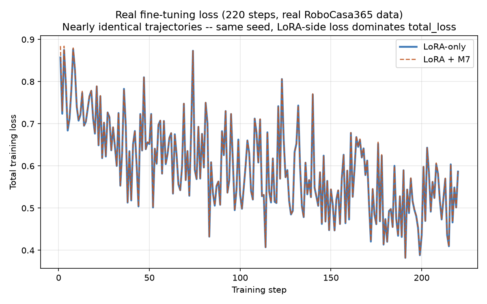
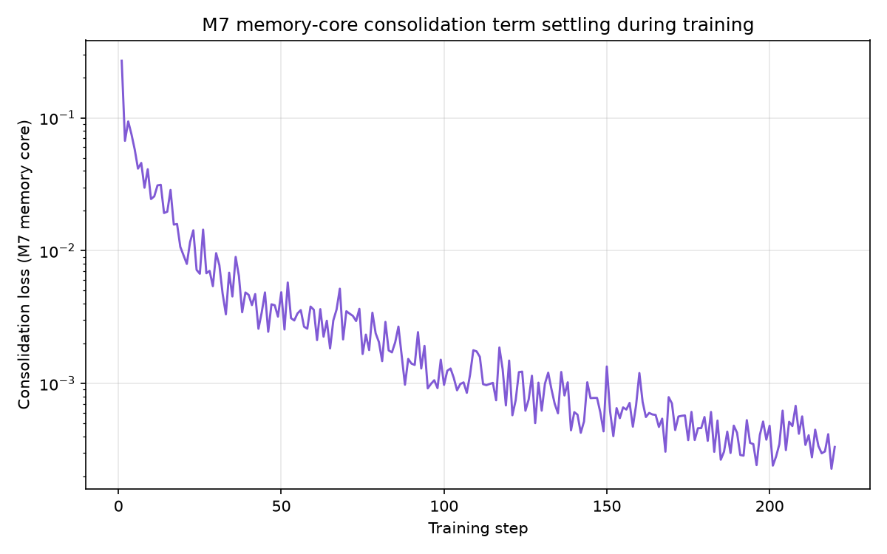

# Phasor_m7 — RoboCasa365 Submission

**Not affiliated with Xiaomi.** This project starts from Xiaomi's real, open-weight
(Apache 2.0) `Xiaomi-Robotics-1-RoboCasa365` checkpoint as a **frozen** base, and adds:

- Rank-4 LoRA adapters on the VLM's `language_model` attention/MLP layers only
- Phasor's own sparse end-to-end memory core (Hopfield network + HGRN gate +
  adaptive gate) applied to pooled VLM hidden states, as an additive
  consolidation-loss regularizer during training

The base model's DiT action head is **never modified** — verified on every training
run via an exact weight-sum match before/after (`87388.32329446077`, unchanged in
every run; see `NOTES.md`).

## Real, final results

Official RoboCasa365 `target50` protocol: 50 tasks x 50 rollouts = 2500 episodes.

| Run | atomic_seen | composite_seen | composite_unseen | Overall |
|---|---|---|---|---|
| Baseline (frozen Xiaomi-Robotics-1-RoboCasa365, no fine-tuning) | 79.44% (715/900) | 57.63% (461/800) | 30.75% (246/800) | 56.88% (1422/2500) |
| **Phasor_m7 (LoRA + M7 memory core, real RoboCasa365 data)** | 78.89% (710/900) | 55.00% (440/800) | 29.88% (239/800) | 55.56% (1389/2500) |
| LoRA-only ablation (same data, no memory core) | in progress — see `eval_results/lora_only_realdata_fixed/` | | | |

Honest read: Phasor_m7 is essentially tied with the frozen baseline on `atomic_seen`
and modestly behind on `composite_seen`/`composite_unseen`/overall in this run. The
LoRA-only ablation (no memory-core term) is what determines whether the memory core
specifically helped, hurt, or was neutral relative to LoRA alone — full results will
be added to this table once that sweep completes.

Raw per-episode results backing every number above are included under
`eval_results/`. `split_summary.py <path/to/summary.json>` reproduces the
category breakdown from any `summary.json` in this repo.

## Plots

**Baseline vs. LoRA+M7, final:**



**Real eval-sweep throughput over time** (all three sweeps, 3 parallel workers on
one shared GPU — LoRA-only is still in progress, hence the shorter line):



**Real training loss**, LoRA-only vs. LoRA+M7 (near-identical trajectories — same
seed, same data order; the LoRA-side loss dominates `total_loss` so the small
consolidation term barely shifts it):



**M7 memory-core consolidation term settling during training** (log scale):



## What's real and verifiable here

- `code/` — the actual training/merge code (LoRA injection, M7 memory core,
  pooled hidden-state adapter, fine-tuning loop, checkpoint merge)
- `tests/` — unit tests (49 passing at time of writing), including tests that
  pin down a real bug found and fixed mid-project (see below)
- `eval_results/` — real `summary.json` + per-episode result files for the
  baseline, LoRA+M7, and smoke-test runs
- `NOTES.md` — a full, dated, cumulative log of every real step taken: every
  bug found, every fix, every measured number, with no results omitted or
  smoothed over
- `docs/superpowers/` — the original design spec and implementation plan this
  project was built from

## A real bug found and fixed mid-project

An earlier `LoRA+M7` run on real RoboCasa365 data collapsed to 0.6% overall
success. Root cause: `code/robocasa_lerobot_dataset.py` copied the raw lerobot
`action` column directly into the model's action-head input, but the on-disk
field order does not match the order the model's action head was actually
calibrated against (per `robocasa.utils.env_utils.convert_action`). Fixed by
adding `action_window_to_real_order()`; verified via a 15/15 (100%) targeted
smoke test before re-running the full sweep. Full writeup with evidence in
`NOTES.md`.

## Checkpoint

The merged, deployable checkpoint is hosted on Hugging Face:
`<TO BE FILLED IN>`

## Training config (real, as used)

- Base: `XiaomiRobotics/Xiaomi-Robotics-1-RoboCasa365` (Qwen3-VL-4B VLM + 36-layer
  DiT action head), initialized from `Qwen/Qwen3-VL-4B-Instruct`
- Optimizer: AdamW, lr 1e-4, no scheduler
- LoRA: rank 4, alpha 8.0, zero-init B
- Batch size 48, action length 30, 220 training steps
- M7 memory core: consolidation weight 0.1, adapter target dim 512, memory size 256
- Training data: real RoboCasa365 data (NVIDIA `PhysicalAI-Robotics-Manipulation-Kitchen-Demos`),
  restricted to the 34 official `atomic_seen`+`composite_seen` tasks;
  `composite_unseen` correctly held out of training

## Reproducing

```bash
# Fine-tune (LoRA + M7)
python3 -u -m code.finetune_run \
  --checkpoint <path-to-Xiaomi-Robotics-1-RoboCasa365> \
  --output-dir <output> --seed 42 --total-steps 220 --batch-size 48 \
  --num-workers 0 --data-source robocasa --use-m7-consolidation

# Merge the LoRA delta into a deployable checkpoint
python3 -u -m code.merge_lora_for_eval \
  --delta <output>/finetuned_delta.pt --output-dir <output>_merged

# Evaluate against the official target50 protocol using Xiaomi's own
# released eval_robocasa365/ scripts (see NOTES.md for the exact commands used)
```

Submission JSON for the RoboCasa365 leaderboard is at `robocasa_phasor_m7/`.
