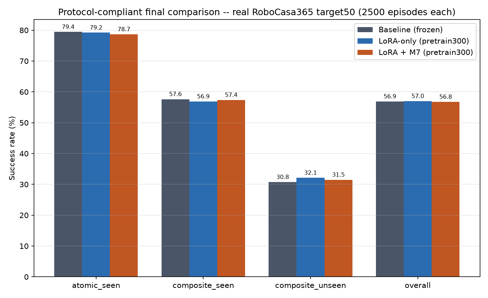
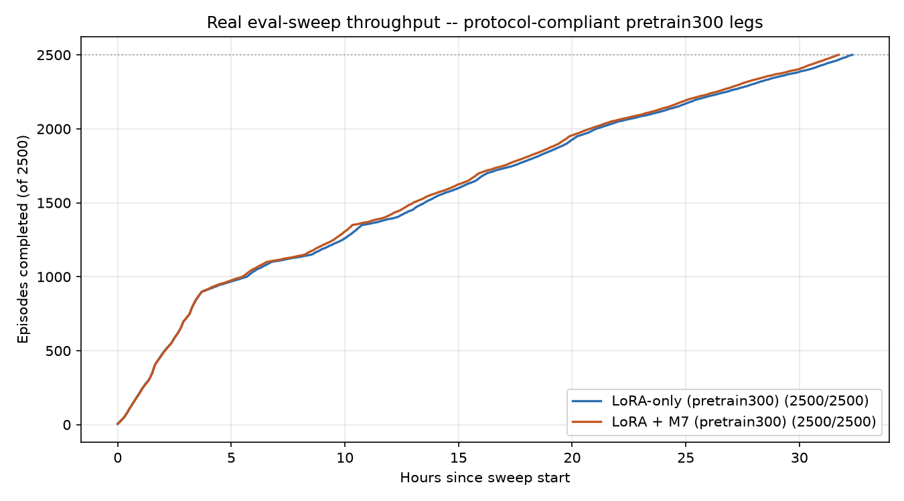
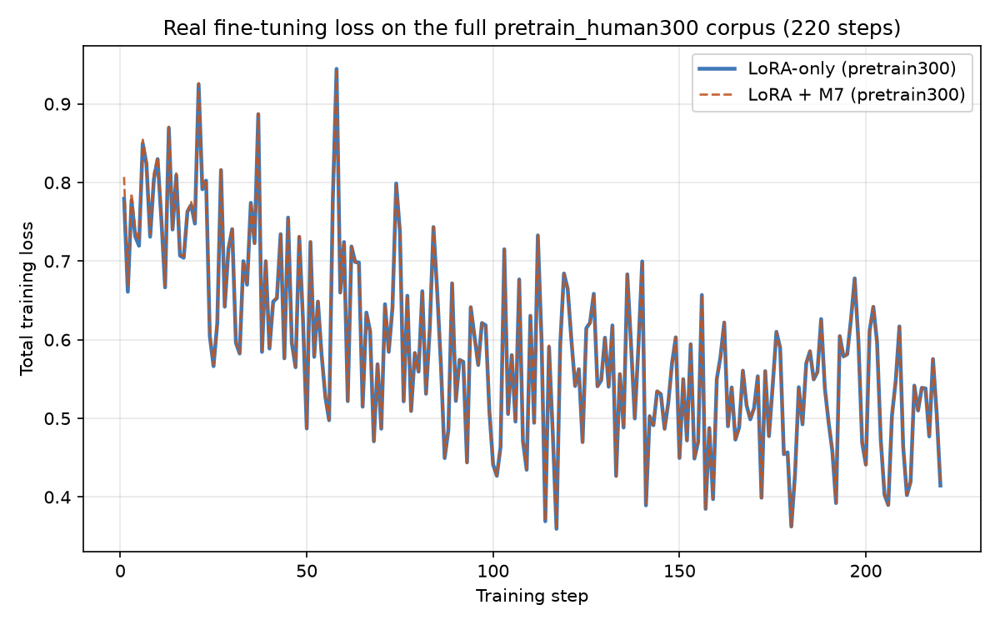
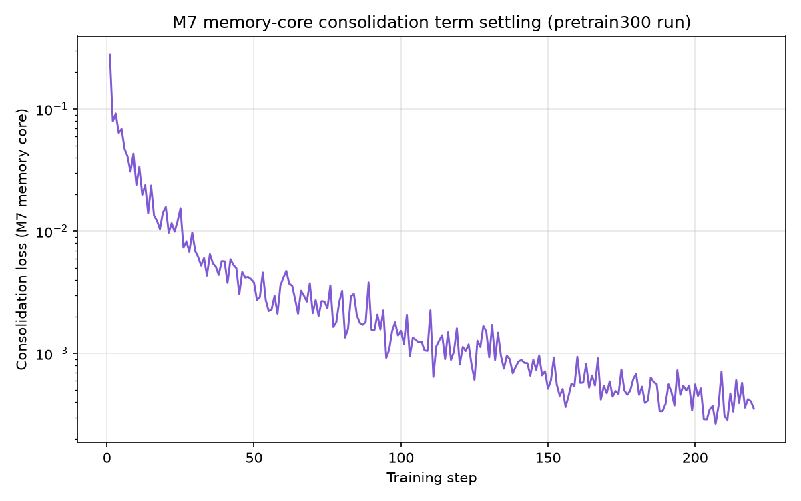

# Phasor_m7 — RoboCasa365 Submission

**Not affiliated with Xiaomi.** This project starts from Xiaomi's real, open-weight
(Apache 2.0) `Xiaomi-Robotics-1-RoboCasa365` checkpoint as a **frozen** base, and adds:

- Rank-4 LoRA adapters on the VLM's `language_model` attention/MLP layers only
- Phasor's own sparse end-to-end memory core (Hopfield network + HGRN gate +
  adaptive gate) applied to pooled VLM hidden states, as an additive
  consolidation-loss regularizer during training

The base model's DiT action head is **never modified** — verified on every training
run via an exact weight-sum match before/after (`87388.32329446077`, unchanged in
every run; see `NOTES.md`).

## Protocol correction

The RoboCasa365 leaderboard maintainer flagged that fine-tuning data must be the
full `pretrain_human300` corpus (300 tasks) — an earlier version of this submission
restricted training to the 34 `atomic_seen`+`composite_seen` tasks, which overlaps
the eval and made the numbers incomparable to other entries. Both ablation legs
were retrained from scratch on the full, verified `pretrain_human300` corpus (65
atomic + 235 composite tasks, confirmed 300/300 present on disk, 0/16
`composite_unseen` tasks leak in) and fully re-evaluated. **The results below are
the real, protocol-compliant numbers.** The original 34-task numbers are kept in
`NOTES.md`/`robocasa_phasor_m7/submission.json` for historical record only, marked
invalid.

## Real, final results (protocol-compliant)

Official RoboCasa365 `target50` protocol: 50 tasks x 50 rollouts = 2500 episodes.
Both ablation legs trained on the full `pretrain_human300` corpus (300 tasks), same
seed/budget (220 steps, batch 48) for direct comparability.

| Run | atomic_seen | composite_seen | composite_unseen | Overall |
|---|---|---|---|---|
| Baseline (frozen Xiaomi-Robotics-1-RoboCasa365, no fine-tuning) | 79.44% (715/900) | 57.63% (461/800) | 30.75% (246/800) | 56.88% (1422/2500) |
| LoRA-only (pretrain300) | 79.22% (713/900) | 56.88% (455/800) | **32.12% (257/800)** | **57.00% (1425/2500)** |
| **Phasor_m7 (LoRA + M7, pretrain300)** | 78.67% (708/900) | 57.38% (459/800) | 31.50% (252/800) | 56.76% (1419/2500) |

**Honest verdict: M7's memory core does not add value over LoRA alone.** LoRA-only
is the only one of the three to beat the frozen baseline overall (+0.12pt) and has
the strongest `composite_unseen` result (+1.37pt over baseline) — the category that
actually tests generalization to held-out tasks. LoRA+M7 also beats baseline on
`composite_unseen` (+0.75pt, so the memory core is not harmful) but underperforms
LoRA-only on `atomic_seen`, `composite_unseen`, and overall; only `composite_seen`
favors LoRA+M7, by 0.5pt. LoRA+M7's overall result lands slightly below baseline.

Raw per-episode results backing every number above are included under
`eval_results/`. `split_summary.py <path/to/summary.json>` reproduces the
category breakdown from any `summary.json` in this repo.

## Plots

**Baseline vs. LoRA-only vs. LoRA+M7, final (pretrain300, protocol-compliant):**



**Real eval-sweep throughput over time** (both pretrain300 legs, 3 parallel workers
on one shared GPU, run sequentially):



**Real training loss**, LoRA-only vs. LoRA+M7 on pretrain300 (near-identical
trajectories — same seed, same data order; the LoRA-side loss dominates
`total_loss` so the small consolidation term barely shifts it):



**M7 memory-core consolidation term settling during training** (log scale):



<details>
<summary>Earlier (superseded, protocol-invalid) plots — 34-task training data</summary>


</details>

## What's real and verifiable here

- `code/` — the actual training/merge code (LoRA injection, M7 memory core,
  pooled hidden-state adapter, fine-tuning loop, checkpoint merge). Includes
  `--robocasa-task-set {seen34,pretrain300}` for reproducing either version.
- `tests/` — unit tests (49 passing at time of writing), including tests that
  pin down a real bug found and fixed mid-project (see below)
- `eval_results/` — real `summary.json` + per-episode result files for the
  baseline, both pretrain300 legs, both original 34-task legs, and smoke tests
- `NOTES.md` — a full, dated, cumulative log of every real step taken: every
  bug found, every fix, every measured number, with no results omitted or
  smoothed over
- `docs/superpowers/` — the original design spec and implementation plan this
  project was built from

## A real bug found and fixed mid-project

An earlier `LoRA+M7` run on real RoboCasa365 data collapsed to 0.6% overall
success. Root cause: `code/robocasa_lerobot_dataset.py` copied the raw lerobot
`action` column directly into the model's action-head input, but the on-disk
field order does not match the order the model's action head was actually
calibrated against (per `robocasa.utils.env_utils.convert_action`). Fixed by
adding `action_window_to_real_order()`; verified via a 15/15 (100%) targeted
smoke test before re-running the full sweep. Full writeup with evidence in
`NOTES.md`.

## Checkpoint

Merged, deployable checkpoints (pretrain300, protocol-compliant) are hosted on
Hugging Face:

- [Project-Phasor/phasor-m7-robocasa365](https://huggingface.co/Project-Phasor/phasor-m7-robocasa365) — LoRA+M7, the submission checkpoint
- [Project-Phasor/phasor-lora-only-robocasa365](https://huggingface.co/Project-Phasor/phasor-lora-only-robocasa365) — LoRA-only ablation checkpoint

## Training config (real, as used)

- Base: `XiaomiRobotics/Xiaomi-Robotics-1-RoboCasa365` (Qwen3-VL-4B VLM + 36-layer
  DiT action head), initialized from `Qwen/Qwen3-VL-4B-Instruct`
- Optimizer: AdamW, lr 1e-4, no scheduler
- LoRA: rank 4, alpha 8.0, zero-init B
- Batch size 48, action length 30, 220 training steps
- M7 memory core: consolidation weight 0.1, adapter target dim 512, memory size 256
- Training data: real RoboCasa365 `pretrain_human300` corpus (300 tasks: 65 atomic
  + 235 composite, verified 0/16 `composite_unseen` tasks leak in)

## Reproducing

```bash
# Fine-tune (LoRA + M7, protocol-compliant pretrain300 data)
python3 -u -m code.finetune_run \
  --checkpoint <path-to-Xiaomi-Robotics-1-RoboCasa365> \
  --output-dir <output> --seed 42 --total-steps 220 --batch-size 48 \
  --num-workers 0 --data-source robocasa --robocasa-task-set pretrain300 \
  --use-m7-consolidation

# Merge the LoRA delta into a deployable checkpoint
python3 -u -m code.merge_lora_for_eval \
  --delta <output>/finetuned_delta.pt --output-dir <output>_merged

# Evaluate against the official target50 protocol using Xiaomi's own
# released eval_robocasa365/ scripts (see NOTES.md for the exact commands used)
```

Submission JSON for the RoboCasa365 leaderboard is at `robocasa_phasor_m7/`.
