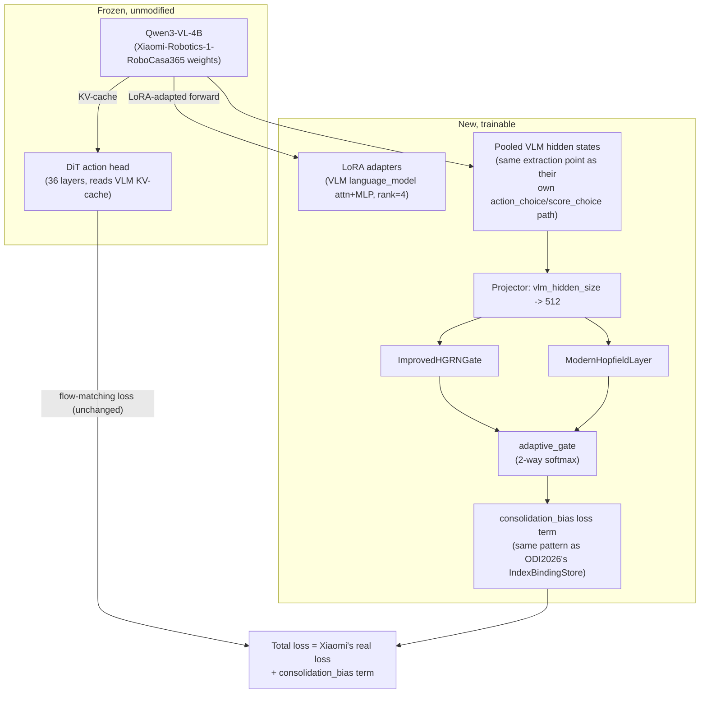

# Xiaomi-Robotics-1 + M7 Memory Core: A Real RoboCasa Leaderboard Submission — Design

## Problem

M7's own from-scratch RoboCasa policy (action-chunking flow-matching, trained on the
pod today) is scoring 0-4% success on the real official RoboCasa365 eval protocol,
across every checkpoint evaluated this project (~18 historical evals plus today's
live eval sweep). That is not a competitive number: the actual leaderboard reference,
Xiaomi-Robotics-1, reports 80.2% (atomic-seen) / 57.1% (composite-seen) / 32.1%
(composite-unseen) on the same benchmark, using their own real, released,
Apache-2.0-licensed 5B-parameter model
(`XiaomiRobotics/Xiaomi-Robotics-1`, arXiv:2607.15330).

Rather than continuing to train a from-scratch policy that is nowhere near
competitive, this project builds a real, honestly-attributable submission by
lightly adapting Xiaomi's already-strong pretrained checkpoint — keeping their
trained action head fully intact — while giving M7's own continual-learning
memory architecture a genuine, honestly-scoped role in the result.

This is a separate, parallel project to `xr1-continual` (which LoRA-fine-tunes
Xiaomi's own head sequentially across 3 task batches with Synaptic Intelligence,
specifically to demonstrate forgetting-resistance — its own Non-goals section
states it is not attempting a competitive leaderboard number). This project's
goal is the opposite: a real submittable checkpoint, not a forgetting-resistance
demonstration. The two projects may share code where it fits naturally (e.g. a
similar LoRA injection pattern), but are tracked, evaluated, and reported on
separately so neither project's claims get diluted by the other's.

## Their real architecture (verified directly from their released code)

Pulled from `xr1/mibot/models/VLA/XR1.py` in `XiaomiRobotics/Xiaomi-Robotics-1`
(GitHub, main branch, as of today):

- **VLM**: `Qwen3-VL-4B-Instruct`, loaded via HuggingFace `transformers`
  (`Qwen3VLForConditionalGeneration`). `vlm_hidden_size` comes from
  `self.vlm.config.text_config.hidden_size` at runtime — not hardcoded here,
  since it's read from their published config, not assumed.
- **Action head (DiT)**: a 36-layer, 1024-dim decoder-only transformer
  (`DiT(layer_num=36, hidden_size=1024)`) that does **not** consume a simple
  pooled feature vector. It directly attends into the VLM's own per-layer KV
  cache (`past_key_values`, extracted from the running VLM forward pass and
  repacked via `_unpad`) through causal attention over concatenated
  sink+state+action tokens, using a rectified-flow / flow-matching objective
  (Beta-sampled interpolation timestep between noise and real action,
  `state_shape=(1,60)`, `action_shape=(30,60)`).
- **Auxiliary "choice" path**: the VLM also predicts discretized action
  choices directly via special tokens (`ACTION_START_ID`/`ACTION_END_ID`/
  `SCORE_ID`), reading `vlm_outputs.hidden_states` at those token positions
  through `action_projector_choice`/`score_projector_choice`. This is the one
  place in their released architecture where a *pooled, non-DiT* hidden-state
  representation already exists and is used for a real training signal — the
  natural, non-invasive integration point for a new mechanism.

**Implication for this design**: because the DiT is deeply coupled to the
VLM's raw KV-cache rather than a clean interface, replacing it with M7's
memory core (an earlier idea, rejected during design) would have required
real surgery on their attention-caching internals and risked breaking their
trained action generation entirely. Confirmed via reading their actual code,
not assumed.

## Architecture



- Xiaomi's full released loss (`loss_mse`, `loss_freq`, `loss_choice`,
  `loss_score` — all four terms, exactly as in their `forward()`) is kept
  unchanged. The only addition is `+ consolidation_bias` from M7's memory
  core, applied to the LoRA-adapted VLM's pooled hidden states.
- The DiT and its 36-layer KV-cache attention path are **never modified,
  never re-initialized, never fine-tuned** — their trained action generation
  stays exactly as released.
- LoRA target modules: the VLM's `language_model` attention (`q_proj`,
  `k_proj`, `v_proj`, `o_proj`) and MLP (`gate_proj`, `up_proj`, `down_proj`)
  Linear layers — real module names, to be confirmed against the actual
  loaded `Qwen3VLForConditionalGeneration` instance in the implementation
  plan's first task (standard Qwen3 naming per HF `transformers`, not
  assumed here). Rank/alpha follow the same values already used in
  `xr1-continual`'s plan (`rank=4, alpha=8.0`, zero-init `B` so LoRA
  contributes nothing extra at initialization) — consistent choice across
  both Xiaomi-based projects, not a new hyperparameter to justify twice.

## What the memory core actually does here — stated honestly

This is a **single, non-sequential fine-tuning run** on RoboCasa365 training
data — not task-batches like `xr1-continual`. There is no formal task
boundary here, so this project makes no claim about resisting forgetting
across discrete tasks. What the consolidation mechanism (HGRN+Hopfield+
adaptive_gate, feeding a `consolidation_bias` regularization term) actually
does is act as a **regularizer against representation drift** as the LoRA
adapters see RoboCasa365's naturally diverse task distribution over one
extended training run — every batch pulls from a different kitchen task,
so there is real non-iid structure within a single run even without
formal task boundaries. This is a real, defensible use of the mechanism,
but a narrower claim than `xr1-continual`'s explicit forgetting-resistance
story, and the write-up must state this distinction precisely rather than
imply this project tested formal continual learning when it did not.

## Hardware / scheduling constraint (verified, not assumed)

Checked live on the pod today: only ~16GB GPU headroom free (32.7GB/49GB
already used by M7's chunking run, JEPA run, and the currently-running
50-task parallel RoboCasa eval sweep). A 5B-parameter model plus LoRA
fine-tuning will not fit alongside that. **This project cannot start real
training until the eval sweep finishes and/or chunking/JEPA are paused** —
this is a scheduling fact to check again at implementation time, not
something to route around by assumption.

## Data and checkpoint

- **Base checkpoint**: `XiaomiRobotics/Xiaomi-Robotics-1-RoboCasa365` (their
  checkpoint already fine-tuned on the exact benchmark being submitted to —
  most direct path to a competitive number, per explicit choice over their
  broader RoboCasa checkpoint or base 5B pretrained model).
- **Training data**: RoboCasa365's own training split, loaded via their
  released data pipeline (`xr1/mibot/data/`, real module — exact loader
  entry point to be confirmed in the implementation plan's first task).

## Evaluation

Their own released `eval_robocasa365/` scripts (real, found in their repo
today) — directly comparable to their published 80.2%/57.1%/32.1% numbers,
and to M7's own eval history on the same benchmark family. Two runs to
compare:

1. **LoRA-only** (no M7 consolidation term) — isolates plain LoRA
   fine-tuning's effect on their checkpoint.
2. **LoRA + M7 consolidation** — the actual proposed method.

The gap between these two is the real, defensible claim this project can
make about M7's contribution — not either run's absolute number in
isolation, same structure as every other ablation in this project's history
(ODI2026's no-binding/binding comparison, `spike-world-model`'s c=0
ablation).

## File structure (new repo: `xr1-m7-submission`, same pod, separate from
`M7`, `xr1-continual`, `spike-world-model`, and `ODI26`)

```
xr1-m7-submission/
├── docs/superpowers/specs/2026-09-03-xr1-m7-submission-design.md   (this file)
├── code/
│   ├── lora_adapters.py        # LoRA injection into VLM language_model layers
│                                 (own implementation — xr1-continual's plan
│                                 documents the same pattern but has no code
│                                 yet to literally import; conceptually reused,
│                                 not copied)
│   ├── m7_memory_core.py       # ImprovedHGRNGate + ModernHopfieldLayer +
│                                 adaptive_gate + consolidation_bias, ported
│                                 from /workspace/ODI26/odi/m7_odi_full_run.py
│   ├── pooled_hidden_adapter.py  # Projector: vlm_hidden_size -> 512
│   ├── finetune_run.py         # single fine-tuning run, both loss terms wired
│   └── eval_wrapper.py         # wraps their real eval_robocasa365 scripts
└── tests/
```

## Testing strategy

- **Local unit tests**: LoRA injection produces expected module replacement
  and leaves base VLM weights `requires_grad=False` (same test pattern as
  `xr1-continual`'s plan); `m7_memory_core.py`'s HGRN/Hopfield/gate math
  checked against the same values already verified working in the ODI2026
  quadmodal work; the pooled-hidden adapter's shape handling tested against
  a dummy `vlm_hidden_size` without needing the real 5B model loaded.
- **Real verification on the pod**: LoRA-only vs LoRA+M7 fine-tuning both
  actually converge; the real `eval_robocasa365` numbers for both runs;
  real wall-clock/VRAM cost of adding this as a fourth process sharing the
  pod's single GPU (a genuinely new cost given the current headroom
  constraint above, not assumed free).

## Non-goals

- Formal sequential-task forgetting demonstration — that is
  `xr1-continual`'s explicit job, not this project's.
- Modifying the DiT action head or its KV-cache attention path in any way.
- Full-parameter fine-tuning of the 5B model — infeasible on this hardware,
  not attempted.
- Beating Xiaomi's own published numbers outright — a realistic successful
  outcome here is "LoRA+M7 matches or modestly improves on their published
  RoboCasa365 numbers while adding a real, honestly-scoped continual-learning
  contribution," not a claim of dramatically surpassing a 5B-parameter model
  trained on 100K+ hours of real trajectories.
- Any change to M7's own from-scratch policy, `xr1-continual`,
  `spike-world-model`, or the currently-running `eval_full_parallel` eval
  sweep.
